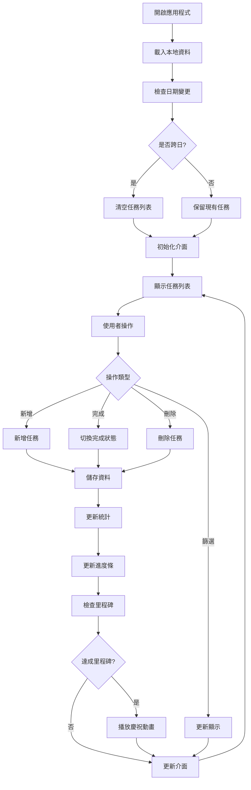
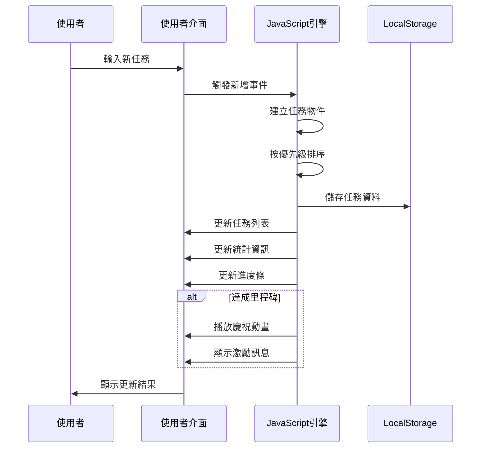

# 待辦清單專案規格文件 (spec.md)

## 專案概述

「☀️ Sunny的酒空清單」是一個基於 HTML/CSS/JavaScript 的單頁面待辦事項管理應用程式，具有調酒主題的介面設計和豐富的互動功能。

## 系統架構

### 技術堆疊
- **前端**: HTML5, CSS3, JavaScript (ES6+)
- **資料存儲**: LocalStorage API
- **部署**: 靜態檔案 (無需後端服務器)

### 檔案結構
```
todo-list-project/
├── index.html          # 主要應用程式檔案
├── README.md            # 專案說明文件
├── spec.md              # 規格文件 (本檔案)
└── todolist.md          # 任務清單
```

## 功能需求規格

### 核心功能

#### 1. 任務管理系統
- **新增任務**: 使用者可輸入任務內容，選擇優先級 (P0-P4)
- **完成任務**: 透過勾選框標記任務完成
- **刪除任務**: 確認後永久刪除任務
- **任務排序**: 按優先級和創建時間自動排序

#### 2. 優先級系統
- **P0 (🔴)**: 最重要 - 緊急任務
- **P1 (🟠)**: 重要 - 高優先級
- **P2 (🟡)**: 普通 - 預設優先級
- **P3 (🟢)**: 較低 - 低優先級
- **P4 (🔵)**: 最低 - 次要任務

#### 3. 統計與進度追蹤
- 即時統計總任務、已完成、待完成數量
- 動態進度條顯示完成百分比
- 里程碑慶祝動畫 (25%, 50%, 75%, 100%)

#### 4. 篩選系統
- **狀態篩選**: 全部、待完成、已完成
- **優先級篩選**: 按 P0-P4 分類檢視

### 介面設計

#### 5. 主題與視覺
- **調酒主題**: 每日隨機顯示調酒推薦語錄
- **漸變背景**: 森林主題綠色漸變動畫
- **動態標題**: 每5秒變換顏色的頭部區域
- **響應式設計**: 支援桌面和行動裝置

#### 6. 動畫效果
- 任務新增的滑入動畫
- 懸停效果和按鈕回饋
- 進度達成時的emoji慶祝動畫
- 平滑的狀態轉換動畫

### 資料管理

#### 7. 本地存儲
- 使用 LocalStorage 保存任務資料
- 日期檢查機制，每日自動重置清單
- 資料格式升級和向後相容性

## 系統流程圖



## 資料結構設計

### 任務物件結構
```javascript
{
    id: Number,              // 唯一識別碼 (時間戳 + 隨機數)
    text: String,           // 任務內容
    completed: Boolean,     // 完成狀態
    createdAt: String,      // 創建時間 (HH:MM 格式)
    priority: String,       // 優先級 (P0-P4)
    priorityNumber: Number  // 優先級數值 (0-4，用於排序)
}
```

### LocalStorage 資料鍵值
- `dailyTodos`: 任務陣列的 JSON 字串
- `lastTodoDate`: 最後使用日期字串

## 循序圖



## 物件關聯圖

```mermaid
classDiagram
    class TodoApp {
        +todos: Array
        +currentFilter: String
        +currentPriorityFilter: String
        +loadTodos()
        +saveTodos()
        +addTodo()
        +toggleTodo()
        +deleteTodo()
        +renderTodos()
        +updateStats()
    }
    
    class Todo {
        +id: Number
        +text: String
        +completed: Boolean
        +createdAt: String
        +priority: String
        +priorityNumber: Number
    }
    
    class UIController {
        +updateDate()
        +updateDailyQuote()
        +updateHeaderColor()
        +bindEvents()
        +createTodoItem()
        +showProgressMessage()
        +createEmojiAnimation()
    }
    
    class StorageManager {
        +loadFromLocalStorage()
        +saveToLocalStorage()
        +checkDateChange()
        +migrateOldData()
    }
    
    class ProgressTracker {
        +calculateProgress()
        +triggerMilestone()
        +updateProgressBar()
        +showCelebration()
    }
    
    TodoApp ||--o{ Todo : contains
    TodoApp ||--|| UIController : uses
    TodoApp ||--|| StorageManager : uses
    TodoApp ||--|| ProgressTracker : uses
```

## 性能需求

### 回應時間
- 任務新增/刪除: < 100ms
- 介面更新: < 50ms
- 動畫播放: 流暢 60fps

### 資料限制
- 單日最大任務數: 100個
- 任務文字長度: 最大100字元
- LocalStorage 使用: < 1MB

## 瀏覽器相容性

### 支援版本
- Chrome 60+
- Firefox 55+
- Safari 12+
- Edge 79+
- iOS Safari 12+
- Android Chrome 60+

### 必要 API
- LocalStorage
- ES6 語法支援
- CSS Grid & Flexbox
- CSS 動畫

## 安全性考量

### 資料安全
- 所有資料儲存在使用者本地
- 無網路傳輸，避免資料洩漏
- HTML 轉義防止 XSS 攻擊

### 輸入驗證
- 任務內容長度限制
- HTML 標籤過濾
- 特殊字元轉義

## 維護性設計

### 程式碼結構
- 模組化函式設計
- 清晰的命名規範
- 完整的註解說明
- 分離的資料和展示邏輯

### 擴充性
- 易於添加新的優先級
- 可擴充的動畫系統
- 彈性的主題配色機制
- 模組化的篩選系統

## 測試規格

### 功能測試
- 任務 CRUD 操作驗證
- 資料持久化測試
- 日期重置機制測試
- 篩選功能測試

### 介面測試
- 響應式設計驗證
- 動畫效果測試
- 使用者體驗流程
- 無障礙功能檢查

### 相容性測試
- 多瀏覽器測試
- 行動裝置測試
- 不同螢幕解析度測試